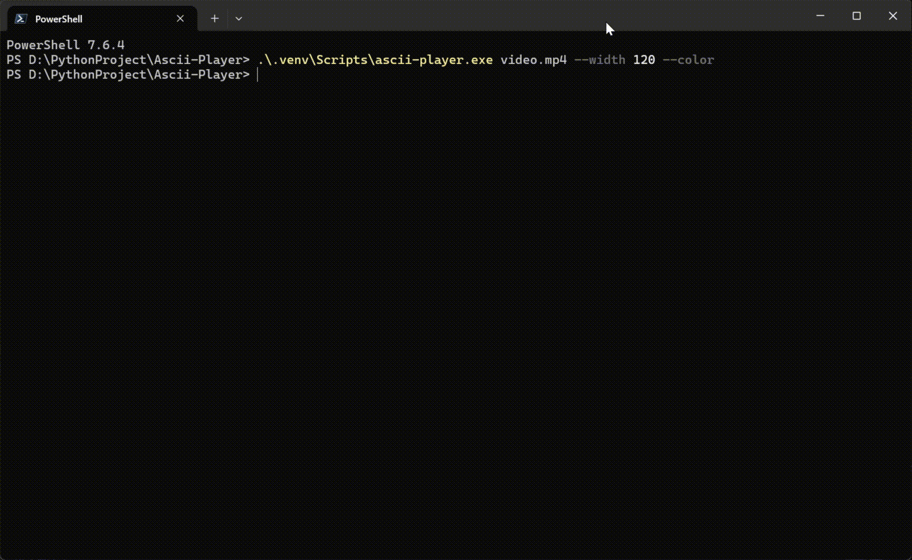
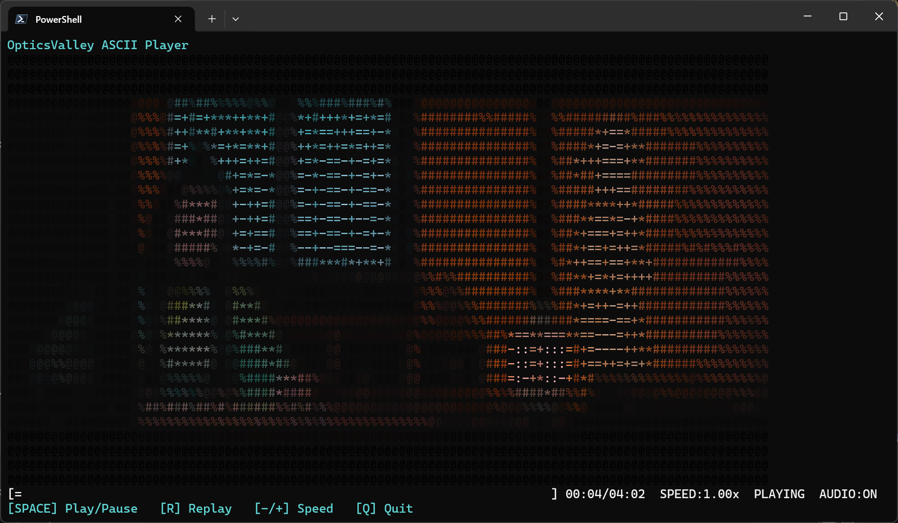
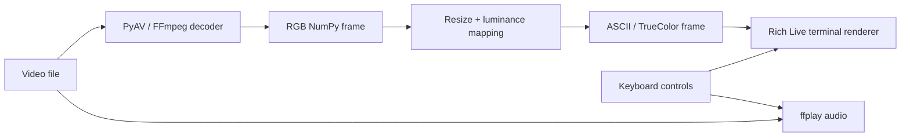

# OpticsValley ASCII Player

[](https://www.python.org/)
[](LICENSE)
[](#环境要求)

一个快速、彩色、无明显闪烁的终端 ASCII 视频播放器。

使用 PyAV/FFmpeg 流式解码视频，通过 NumPy 将画面实时转换成 ASCII 字符，并由
Rich Live 在 Windows Terminal 和 Linux 终端中渲染。支持原视频声音、播放进度、
暂停、重播和倍速控制。

作者：[OpticsValley](#作者)

## 效果展示

### 动态演示



### 静态截图



## 功能特性

- 支持 MP4、MKV、WebM 等 FFmpeg 可解码的视频格式
- 根据视频 PTS 时间戳同步播放，避免固定延时造成累计误差
- 使用 NumPy 向量化完成灰度计算和字符映射
- Rich Live 备用屏幕渲染，退出后恢复原终端内容
- 自动适配终端宽度与高度，窗口尺寸变化后动态重排
- 支持 ANSI 24-bit TrueColor 彩色字符
- 支持 `▀` 半字符模式，一个终端单元显示上下两个彩色采样点
- 使用 `ffplay` 播放原视频音轨
- 暂停、重播和倍速切换时重新同步音频
- 实时显示播放进度、当前时间、总时长、速度和音频状态
- 支持限制渲染 FPS，播放落后时主动丢帧
- 支持 Windows Terminal 和主流 Linux 终端

## 快速开始

### 1. 环境要求

- Python 3.12 或更高版本
- FFmpeg 和 ffplay
- 支持 ANSI 控制序列的终端
- 推荐使用等宽字体

推荐终端：Windows Terminal、WezTerm、Kitty 或 Alacritty。

> PyCharm 的普通 Run 控制台可能无法完整处理备用屏幕和单键输入。建议在 PyCharm
> Terminal 或 Windows Terminal 中运行。

### 2. 安装 FFmpeg

Windows：

```powershell
winget install Gyan.FFmpeg
```

Ubuntu / Debian：

```bash
sudo apt update
sudo apt install ffmpeg
```

Fedora：

```bash
sudo dnf install ffmpeg
```

安装后检查：

```bash
ffmpeg -version
ffplay -version
```

PyAV 的预编译 wheel 通常包含解码所需的 FFmpeg 库，但声音播放仍要求系统能够找到
`ffplay`。如果 `ffplay` 不可用，可以通过 `--mute` 静音运行。

### 3. 安装 ascii-player

```bash
git clone https://github.com/OpticsValley/ascii-player.git
cd ascii-player
python -m venv .venv
```

Windows PowerShell：

```powershell
.\.venv\Scripts\Activate.ps1
python -m pip install --upgrade pip
pip install -e .
```

Linux：

```bash
source .venv/bin/activate
python -m pip install --upgrade pip
pip install -e .
```

安装完成后：

```bash
ascii-player video.mp4 --color
```

也可以不注册命令，直接从源码运行：

```bash
pip install -r requirements.txt
python main.py video.mp4 --color
```

## 使用示例

```bash
# 使用当前终端宽度
ascii-player video.mp4

# 限制为 120 列并开启 TrueColor
ascii-player video.mp4 --width 120 --color

# 彩色半字符模式，提高垂直细节
ascii-player video.mp4 --style block --color

# 密集字符集并限制渲染帧率
ascii-player video.mp4 --charset dense --fps 30

# 静音播放
ascii-player video.mp4 --mute
```

查看完整帮助：

```bash
ascii-player --help
```

## 播放控制

| 按键 | 功能 |
| --- | --- |
| `Space` | 播放 / 暂停 |
| `R` | 从头重新播放 |
| `-` / `+` | 减速 / 加速，范围为 0.50x～2.00x |
| `Q` | 退出播放器 |
| `Ctrl+C` | 强制退出 |

`R` 可以在视频播放期间随时使用。视频正常播放结束后，播放器会自动退出。

## CLI 参数

| 参数 | 默认值 | 说明 |
| --- | --- | --- |
| `VIDEO` | 必填 | 要播放的视频文件 |
| `--width`, `-w` | 当前终端宽度 | 最大输出列数，不会超过终端宽度 |
| `--fps` | 不限制 | 限制渲染 FPS，不改变视频播放速度 |
| `--color / --no-color` | `--no-color` | 开启或关闭 ANSI TrueColor |
| `--audio / --mute` | `--audio` | 开启声音或静音播放 |
| `--style` | `default` | `default` 普通字符；`block` 半字符模式 |
| `--charset` | `default` | `default`、`dense` 或 `block` 字符集 |
| `--help` | — | 显示帮助信息 |

`--style block` 和 `--charset block` 含义不同：

- `--style block` 使用 `▀` 的前景色和背景色组合两个垂直像素。
- `--charset block` 在普通字符模式中使用 ` ░▒▓█` 亮度字符集。

## 内置字符集

字符按从暗到亮排列：

```text
default  @%#*+=-:. 
dense    $@B%8&WM#*oahkbdpqwmZO0QLCJUYXzcvunxrjft/\|()1{}[]?-_+~<>i!lI;:,^`.
block     ░▒▓█
```

## 工作原理



播放器不会把完整视频读入内存。PyAV 逐帧解码为 RGB 数组，转换器先将 1080p 等高
分辨率画面缩小到终端尺寸，再进行向量化亮度映射。播放器使用 `perf_counter()`
把媒体时间戳映射到单调时钟，并在落后较多时跳过视频帧以维持实时播放。

## 项目结构

```text
ascii-player/
├── main.py
├── cli/
│   └── commands.py        # Typer CLI 和错误处理
├── player/
│   ├── audio.py           # ffplay 音频进程管理
│   ├── decoder.py         # PyAV 视频解码与时间戳
│   ├── player.py          # 播放调度、同步与控制
│   └── renderer.py        # Rich Live 界面与进度条
├── ascii/
│   ├── converter.py       # ASCII、TrueColor 和半字符转换
│   └── charset.py         # 内置字符集
├── terminal/
│   ├── console.py         # Rich Console / Windows ANSI
│   └── input.py           # Windows、Linux 非阻塞键盘输入
├── config/
│   └── settings.py        # dataclass 播放配置
├── docs/images/           # GitHub 展示图片
├── pyproject.toml
├── requirements.txt
└── LICENSE
```

## 开发

安装开发依赖并执行静态检查：

```bash
pip install -e ".[dev]"
ruff check .
```

性能会受到视频编码、终端窗口尺寸、颜色模式和终端渲染器影响。普通单色模式输出
的数据量最小；TrueColor 和大窗口会生成更多 ANSI 控制序列。

## 作者

**OpticsValley**

如果这个项目对你有帮助，欢迎在 GitHub 上提交 Issue、Pull Request 或点亮 Star。

## License

本项目基于 [MIT License](LICENSE) 开源。
